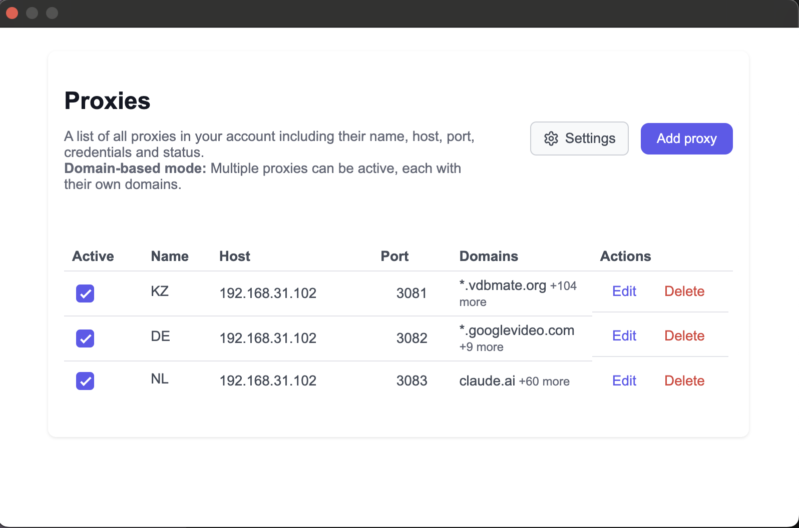
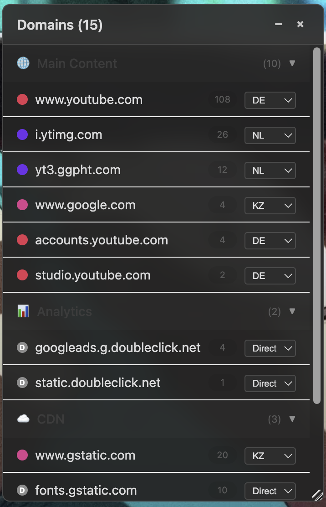

# 🌐 Chrome Proxy Manager

<div align="center" style="margin-bottom: 12px">
  
</div>

<div align="center" style="margin-bottom: 24px">
  <strong>Умное управление прокси на уровне доменов прямо из браузера.</strong>
</div>

Chrome-расширение для автоматического переключения между прокси-серверами в зависимости от домена. Больше никаких ручных переключений — каждый сайт автоматически использует нужный прокси.

---

## 🎯 Зачем это нужно?

**Проблема**: В России заблокированы многие зарубежные сервисы. Приходится постоянно включать/выключать VPN или менять прокси в настройках браузера:
- YouTube, Twitter, ChatGPT через VPN
- Российские сайты напрямую (быстрее)
- Некоторые сервисы через определенные прокси

**Решение**: Настройте один раз — работайте всегда. Расширение автоматически направит заблокированные сайты через нужный прокси, а российские оставит без изменений.

## ✨ Ключевые преимущества

### 🚀 Интеллектуальная маршрутизация
- **Разные прокси для разных доменов** — основная фишка расширения
- Автоматическое переключение без участия пользователя
- Поддержка wildcard-доменов (`*.google.com`, `*.github.com`)
- Система приоритетов для разрешения конфликтов

### ⚡ Два режима работы
- **Global Mode**: Один активный прокси для всех сайтов (простое переключение)
- **Domain-Based Mode**: Множественные активные прокси с умной маршрутизацией

### 🛠 Удобное управление
- Интуитивный интерфейс без лишних настроек
- Контекстное меню — клик правой кнопкой для добавления домена
- Контекстное меню — просмотр и добавление всех доменов через интерфейс
- Bulk-импорт прокси из разных форматов
- Визуальные индикаторы состояния и конфликтов

---

## 📸 Как это выглядит

<!--
Добавьте сюда скриншот или GIF демонстрирующий:
1. Главное окно расширения
2. Процесс добавления прокси
3. Настройку доменов
4. Работу контекстного меню

Рекомендуемый размер: 800x600px
Формат: PNG или WebP для статичных изображений, GIF для демонстрации
-->

### Интерфейс расширения

<div align="center">
  
  <br>
  <em>Настройка прокси-серверов и привязка доменов</em>
</div>

<br>

<div align="center">
  
  <br>
  <em>Просмотр доменов текущего сайта через контекстное меню</em>
</div>

---

## 🚀 Быстрый старт

### Для пользователей (готовая сборка)

1. **Скачайте** последний релиз с [GitHub Releases](../../releases)
2. **Откройте** Chrome → `chrome://extensions/`
3. **Включите** "Режим разработчика" (Developer mode)
4. **Нажмите** "Загрузить распакованное расширение" (Load unpacked)
5. **Выберите** папку с расширением
6. **Готово!** Иконка появится в панели инструментов

### Для разработчиков (сборка из исходников)

```bash
# Клонируйте репозиторий
git clone https://github.com/your-username/chrome-proxy-extension.git
cd chrome-proxy-extension

# Установите зависимости
npm install

# Соберите расширение
npm run build

# Загрузите в Chrome
# 1. Откройте chrome://extensions/
# 2. Включите "Developer mode"
# 3. Нажмите "Load unpacked"
# 4. Выберите папку ./dist
```

---

## 💡 Использование

### 1️⃣ Добавление первого прокси

```
Форматы поддержки:
✅ host:port
✅ host:port:username:password
✅ username:password@host:port
```

### 2️⃣ Настройка доменов

**Вариант А**: Через интерфейс
- Откройте расширение → Add Domain → введите домен

**Вариант Б**: Через контекстное меню
- ПКМ на странице → "Add to [Proxy Name]"

### 3️⃣ Примеры настройки

```yaml
# Заблокированные видеохостинги
YouTube прокси:
  - youtube.com
  - *.youtube.com
  - *.googlevideo.com
  - *.ytimg.com

# Социальные сети
VPN прокси:
  - chatgpt.com
  - *.twitter.com
  - *.tiktok.com

# Зарубежные IT-сервисы
IT прокси:
  - *.github.com
  - *.stackoverflow.com
  - *.medium.com
  - *.discord.com
```

---

## 🏗 Сборка и разработка

### Системные требования

- **Node.js** 16+
- **Chrome** 88+
- **npm** или **yarn**

### Структура проекта

```
src/
├── background.ts          # Service Worker, PAC-скрипты
├── popup.tsx             # Главное окно расширения
├── content-script.ts     # Интеграция с веб-страницами
├── components/           # React компоненты
│   ├── ProxyTable.tsx    # Таблица прокси
│   ├── AddProxyForm.tsx  # Форма добавления
│   └── ...
└── utils/
    ├── storage.ts        # Работа с хранилищем
    └── domainTracker.ts  # Отслеживание доменов
```

### Команды разработки

```bash
# Режим разработки с hot reload
npm run dev

# Продакшн сборка
npm run build

# Предпросмотр сборки
npm run preview
```

### Отладка

1. **Background script**: `chrome://extensions/` → расширение → "background page"
2. **Popup**: ПКМ на иконке → "Проверить элемент"
3. **Content script**: F12 в любой вкладке → Console → выбрать context

---

## 🔧 API и настройки

### Поддерживаемые протоколы
- HTTP (`http://proxy:8080`)

### Продвинутые настройки

```javascript
// Настройки в chrome.storage.local
{
  "proxyMode": "domain" | "global",
  "proxies": [
    {
      "id": "unique-id",
      "name": "Display Name",
      "host": "proxy.example.com",
      "port": 8080,
      "username": "optional",
      "password": "optional",
      "domains": ["*.example.com", "test.local"],
      "enabled": true,
      "priority": 1
    }
  ]
}
```

---

## 🤝 Участие в разработке

Мы открыты для вклада! Вот как можно помочь:

### Быстрый вклад
- 🐛 **Bug reports**: Создайте issue с подробным описанием
- 💡 **Feature requests**: Поделитесь идеями улучшений
- 📝 **Документация**: Исправления и дополнения приветствуются
- 🌍 **Переводы**: Помогите с локализацией

### Разработка

1. **Fork** репозиторий
2. **Создайте** feature-ветку: `git checkout -b feature/amazing-feature`
3. **Тестируйте** в обоих режимах (Global/Domain-Based)
4. **Коммитьте**: `git commit -m 'Add amazing feature'`
5. **Push**: `git push origin feature/amazing-feature`
6. **Откройте** Pull Request

---

## 📄 Лицензия

Этот проект распространяется под лицензией [MIT](LICENSE).

---

## 🙋‍♂️ Поддержка

- 📚 **Документация**: Посмотрите [Wiki](../../wiki)
- 🐛 **Баги**: Создайте [Issue](../../issues/new?template=bug_report.md)
- ✉️ **Email**: support@yourproject.com

---

<div align="center">

**⭐ Поставьте звездочку, если проект оказался полезным!**

Made with ❤️ for Chrome power users

</div>
